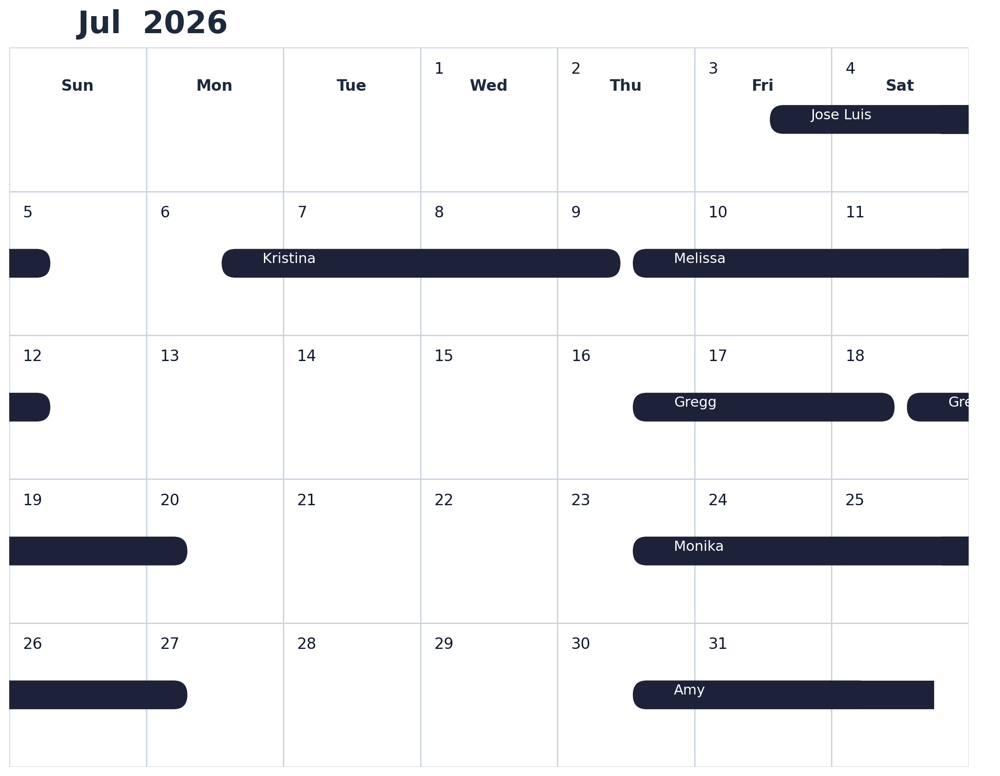

# Draw a vrbo calendar from a vrbo Host's reservation calendar
Given a vrbo calendar url pull the calendar, draw the calender including reservations and blocks and then send it inline in an email 

Using the host's synchronization url the output is a png file that resembles the vrbo websites booking calendar 
The program run in cron will detect changes from the previous run and send the calendar again to an email or as mms to a phone to maid serices or maintenance personnell

# prepare 
install requirements file from requirements.txt  
  pip install -r requirements.txt

create a config.py with all the needed constants:
   ICAL_URL="https://www.vrbo.com/icalendar/xxxxxxx.ics?nonTentative" 
   SMTP_SERVER = "smtp.gmail.com" 
   SMTP_PORT = 587 
   SENDER_EMAIL = "someone@gmail.com" 
   RECIPIENT_EMAIL = "someone@outlook.com" 
   SENDER_PASSWORD = "" 

# run the script  
./venv/bin/activate   

usage: compare_vrbo_calendar.py [-h] [--month {1,2,3,4,5,6,7,8,9,10,11,12}] [--email EMAIL] [--nextmonth] [--year YEAR]

Generate and email a calendar for a specified month.

optional arguments:  
  -h, --help            show this help message and exit 
  --month {1,2,3,4,5,6,7,8,9,10,11,12}  
                        Month number (1-12) 
  --email EMAIL         recipient email 
  --nextmonth           Process the upcoming month's data window 
  --year YEAR           Year (e.g., 2025) 

# example cron 
  
20 8-18 * * * cd /home/vrbo/vrbo_calendar_drawer && source venv/bin/activate && python compare_vrbo_calendar.py  > /home/vrbo/vrbo_calendar_drawer/cron.output.log 2>&1  
20 8-18 20-31 * * cd /home/vrbo/vrbo_calendar_drawer && source venv/bin/activate && python compare_vrbo_calendar.py --nextmonth > /home/vrbo/vrbo_calendar_drawer/cron.output1.log 2>&1

